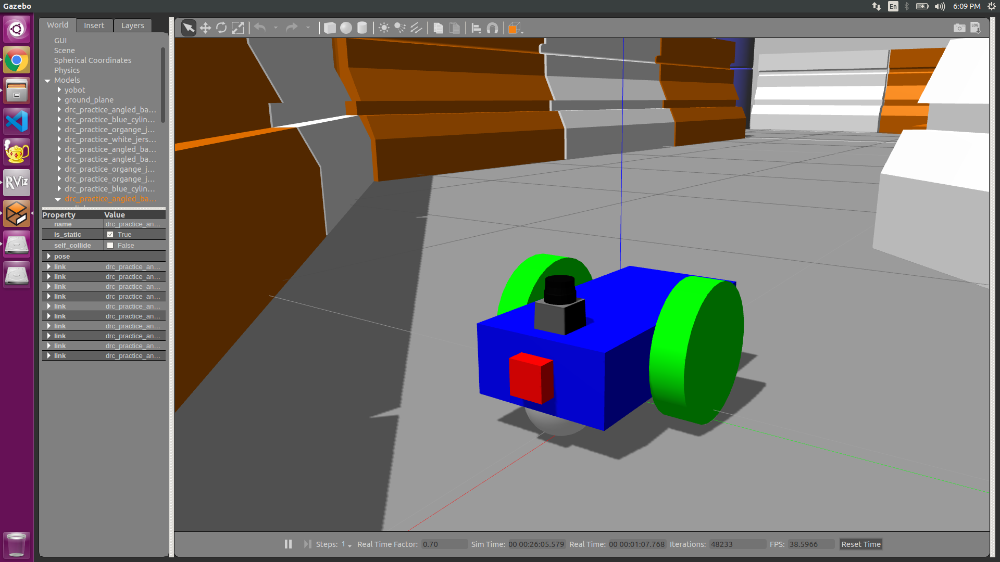
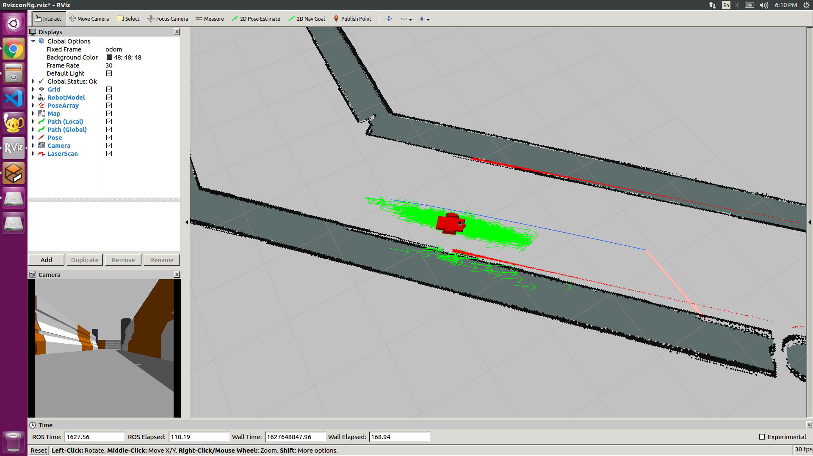
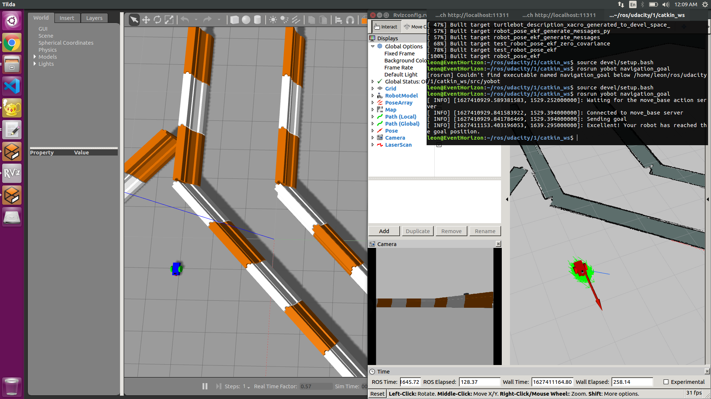

# Localization-and-Mapping-in-ROS
Localisation using ROS amcl package and Navigation using ROS move_base package



## Project Requirements
- Ubuntu 16.04 or 18.04
- ROS Kinetic or Melodic

## Install the required ROS packages
```
$ sudo apt-get install ros-kinetic-navigation
$ sudo apt-get install ros-kinetic-map-server
$ sudo apt-get install ros-kinetic-move-base
$ rospack profile
$ sudo apt-get install ros-kinetic-amcl
```

## Setup the Repo
```
$ cd
$ mkdir -p catkin_ws/src
$ cd catkin_ws/src
$ git clone https://github.com/YashKSahu/Localization-and-Mapping-in-ROS.git
$ rosdep install --from-paths src --ignore-src -r -y
$ sudo apt-get install ros-kinetic-<missing dependencies> //skip if all rosdeps installed
$ cd catkin_ws
$ catkin_make
$ source devel/setup.bash
```

## Launch the simulation
Launch the world and amcl, move_base node along with Rviz for ROS visualization. 

```
$ cd catkin_ws
$ roslaunch yobot yo_world.launch
$ roslaunch amcl.launch // Open this in a new terminal
```

## Goal Navigation
In a new terminal, run this node to give the robot a goal and test whether it reaches it.

```
$ rosrun yobot navigation_goal
```


